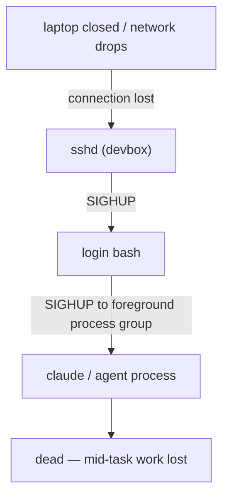
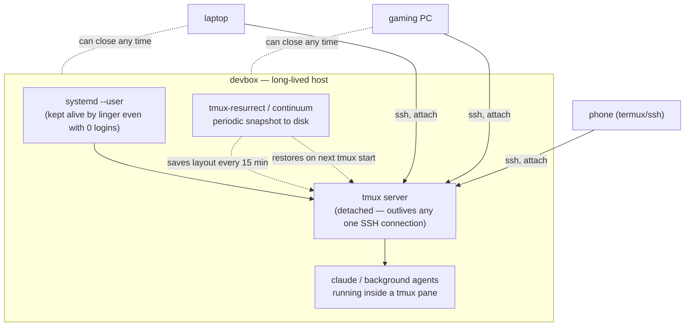

# Session persistence — the devbox as a persistent agent host

The goal: SSH into the devbox from whatever machine is at hand (gaming PC,
laptop, phone), start work — including long-running or unattended agent work
— and be able to close that client at any point without killing anything.
The client becomes a disposable window onto state that lives on the devbox,
not the thing keeping that state alive.

## Why a plain SSH session doesn't survive

By default, a shell started over SSH is a *child of that SSH connection*.
Closing the client (or losing the network) drops the connection, `sshd` on
the devbox exits, and everything hanging off that login dies with it:



This is true even for something that *looks* long-running, like a Claude Code
session driving background agents — if the parent shell was a plain foreground
SSH login with nothing protecting it, disconnecting kills it.

## The three layers, and what each one actually buys

| Layer | Survives | Does not survive |
|---|---|---|
| **tmux** (detach/reattach) | SSH disconnect, laptop closed, network drop | tmux server itself dying (VM reboot, crash, `kill-server`) |
| **`loginctl enable-linger`** | The *last* SSH session closing (zero logins at all) | The machine rebooting |
| **tmux-resurrect + tmux-continuum** | tmux server death, VM reboot | Recovering a program's actual in-memory state — it restarts the pane in the same directory, it does not resume the process |

Which daemons those layers are keeping alive — who owns each, and how to check
one — is inventoried in [`services.md`](services.md).

They stack. None of them alone covers "close the laptop, reboot the devbox a
day later, come back to the same panes":



Any client attaches to the same session; none of them owns it. Close one,
open another later, `tmux attach` picks up exactly where it was.

The phone in that diagram reaches tmux through a terminal emulator, which is
serviceable for checking on a run and awkward for anything else. For driving
agent work from a phone directly — starting threads, reading diffs, approving
steps — see [`t3code.md`](t3code.md), which runs a harness server beside this
stack rather than inside it.

## Setting it up

1. **Always work inside tmux**, not a bare login shell:
   ```bash
   tmux new -s work      # or: tmux attach -t work
   ```
   See [`tmux.md`](tmux.md) for the full key-binding reference. This alone
   covers "I closed my laptop" and "my WiFi dropped."

2. **Enable linger once per machine**, so the tmux server (and anything
   under it) survives having *no* logged-in session at all — not just no
   foreground process:
   ```bash
   sudo scripts/provision-persistence.sh
   ```
   Without this, `systemd-logind` can tear down the user's systemd instance,
   and everything running under it, once the last session ends — even a
   detached tmux server. See [`provisioning.md`](provisioning.md) for why
   this is a `scripts/` script and not a chezmoi `run_` step.

3. **tmux-resurrect + tmux-continuum** are wired into `dot_tmux.conf` and
   installed automatically via TPM (`run_onchange_11-install-tmux-plugins.sh`
   reruns whenever the plugin list changes). Continuum snapshots the pane
   layout every 15 minutes and restores it automatically the next time a
   `tmux` server starts cold — the case a reboot produces. This is a safety
   net for the VM disappearing, not a substitute for linger; use both.

## What this changes about running agentic work

With all three layers in place, the devbox stops being "a machine I SSH into
while my session runs" and becomes the actual place the session runs. That
enables the pattern from the captain-model doc
([`agentic-workflow.md`](agentic-workflow.md)) to extend past your own
attention span:

- Kick off a long agent task (a `Workflow`, an overnight capped loop, a
  `/schedule`d cron agent), detach, close the laptop.
- Reattach from a different machine later — the gaming PC is no longer a
  dependency, it's just one of several interchangeable clients.
- Background work started via the `Agent` tool (forks, sub-agents) or the
  `Workflow` tool delivers its result as a notification *inside the still-running
  session* whenever you next attach, exactly as if you'd never left.

The thing to keep straight: tmux/linger/continuum keep the *host process
tree* (and therefore the running Claude Code session) alive. They are not a
replacement for the hard caps the captain model already requires on unattended
loops — an overnight run still needs its own iteration/token ceiling
regardless of how durable the shell underneath it is.
